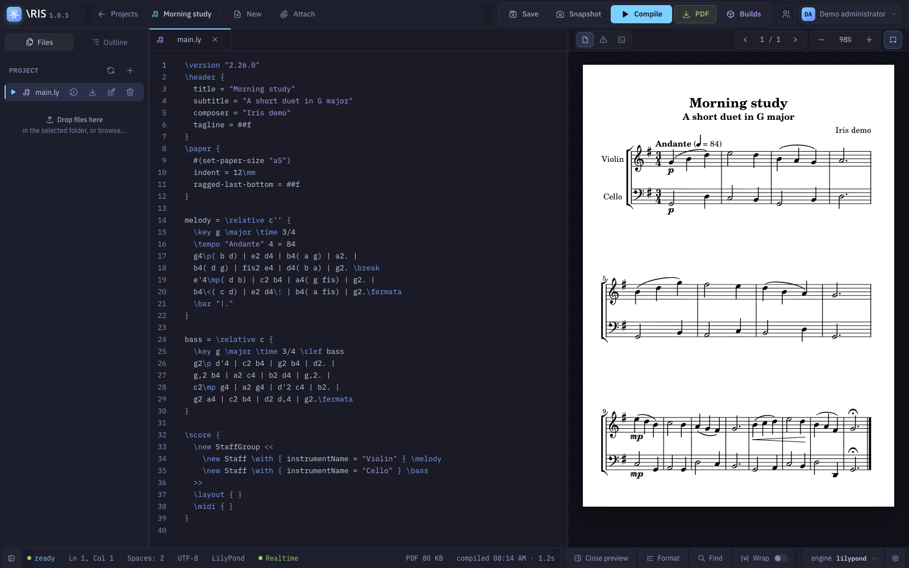
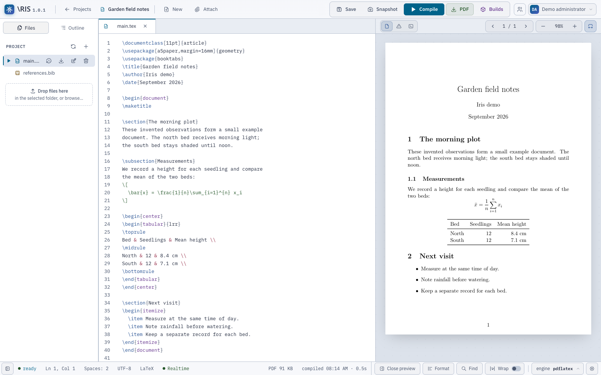

<h1 align="center">
  
  <br>
  <picture>
    <source media="(prefers-color-scheme: dark)" srcset="branding/iris_text_logo_w.svg">
    
  </picture>
</h1>

Iris is a self-hosted web editor for **LaTeX documents and LilyPond scores**.
Write source, manage files and fonts, compile on your server, and read the
result beside your code. You can work alone or share a project with other
accounts on your instance.

**Version 1.0.1** · [Installation](docs/installation.md) ·
[User guide](docs/user-guide.md) · [All documentation](docs/README.md)



## Why I built it

I started with LilyPond. I couldn't find an online editor that brought together
the pieces I needed: editing, compilation, font management and preview, with
the option to host it myself. I wanted an editor shaped around the way I work
on scores, with the source and the engraved result on the same page.

LaTeX came next. There are already good LaTeX editors, but it is the other tool
I use frequently. I was already building an editor around my own needs, so why
not add it? Having both in Iris lets me keep the toolchains on my server and
work from a browser without installing them on every machine.

## What you can do

### Write documents and music

Create LaTeX or LilyPond projects from templates, organize sources into folders,
and upload images, attachments and fonts. Open several files in tabs and use
the outline to move through a document or score.

The CodeMirror editor provides syntax highlighting, search and replace,
formatting, indentation and completion. LaTeX suggestions include your project's
labels and citation keys; LilyPond suggestions include its variables. You can
toggle word wrapping and configure project autosave.

For bibliographies, switch between a reference table and the original BibTeX,
BibLaTeX or RIS text. Add and edit references in a form, including custom fields,
or open their source when you need to work with an expression.

### Compile and inspect the result

Use pdfLaTeX, XeLaTeX or LuaLaTeX with quick, bibliography or index pipelines.
LilyPond projects can produce PDF, PNG, SVG, PS or EPS. Iris previews PDFs and
images, shows compiler diagnostics, and keeps the files from each build in
**Compilation history** for download.

Use **Open preview** or **Close preview** in the footer to open or close the
side panel. The file-tree toggle is at the bottom left beside Ready. On compact
screens, opening the preview switches from the editor to the preview workspace.

Move between a PDF and its source with Ctrl-click or Cmd-click. Navigation
requires a matching build and a supported native toolchain; the
[user guide](docs/user-guide.md#move-between-pdf-and-source) explains the controls
and the [technical guide](docs/source-navigation.md#native-adapters) records the
qualified compiler versions.



### Share work and recover revisions

As an owner, give another account an owner, editor or viewer role. Owners and
editors can edit the same text file together and see each other's cursors and
selections. Presence markers in the file tree and outline show where others are
working; overlap notices flag shared sections or music blocks. A newer-build
notice lets you choose when to replace your preview with a collaborator's result.

Inspect a file's history or restore a previous revision. Builds have their own
history. Owners can adjust retention within the server's limits. Members of all
three roles can export a project as a ZIP; accounts with project-creation rights
can import it into another instance.

### Save your work and choose recovery points

**Save** updates the project's current working copy on the server: files,
folder structure and settings. Accepted live edits also reach the server through
collaboration, and optional project autosave handles project saves for you.

**Snapshot** saves first, then records a manual history revision for each changed
text file. Those revisions include the text itself and can be opened or restored
from file history. Unchanged files do not get duplicate revisions.

The two actions serve different purposes: Save keeps your current work, while
Snapshot lets you choose a recovery point before a substantial rewrite or a new
arrangement. Compilation and idle collaborative editing also record text
revisions automatically. Snapshots cover text-file history; use a full backup
to preserve the entire installation, including assets and settings.

### Use your own instance

Sign in with a local account or OpenID Connect. Administrators manage accounts,
project memberships and the instance's template catalog from the browser.
The interface includes English and Italian, plus system-following light and
dark themes.

## Get started

For a complete editing-and-compilation setup, install **Node.js 24+**,
**PostgreSQL 18+**, and the LaTeX and/or LilyPond tools you intend to use on the
machine running Iris. Follow the [native installation guide](docs/installation.md#native-installation)
to obtain the `R1.0.1` sources, install locked dependencies and create your first
administrator.

You can also [build Iris with Docker or Podman](docs/installation.md#local-container-build).
Both use one Dockerfile and the same Compose file, with an official PostgreSQL
service. **The lightweight Iris image contains no TeX or LilyPond.** It runs the
editor and storage service, but compilation needs executables in Iris's own
runtime. Use the native setup for the documented, qualified compiler workflow.

Once your administrator gives you access:

1. Sign in and change a temporary local password if Iris asks.
2. Create a LaTeX or LilyPond project and choose a template. An external account
   opens a project shared with it instead.
3. Edit `main.tex` or `main.ly`. Choose a LaTeX engine in the editor footer and
   use **Settings → Compilation** for the main file, pipeline or output format.
4. Press **Compile**, read the preview, and open **Builds** for diagnostics or
   downloads. Use **Save** for project changes and **Snapshot** for a history
   checkpoint.

The [user guide](docs/user-guide.md) covers fonts, bibliography forms,
collaboration and recovery in more detail.

## How it works

```text
Browser: editor, project dashboard, PDF/image viewer
   │  same-origin HTTP API + authenticated WebSocket
   ▼
Iris: one Node.js server
   ├── PostgreSQL: accounts, memberships, file history, build records, audit
   ├── Filesystem: sources, assets, fonts, templates, published build files
   └── Native tools: TeX, BibTeX/Biber, MakeIndex, LilyPond
```

The server orders collaborative edits and writes project content to disk.
Iris uses the filesystem and PostgreSQL for different parts of that persistence:

| Storage | What it contains |
| --- | --- |
| **Filesystem** | Current source files, images, attachments, fonts, templates, project state/settings and generated PDFs or other build files. Working sources remain ordinary files. |
| **PostgreSQL** | Accounts, permissions, project/file identities, **historical text contents** for revision history and restore, build metadata/logs/diagnostics, and the audit trail. |

For a build, it saves the project and copies its sources into a separate working
directory. Later edits can continue while the compiler runs against that copy.
Successful builds keep their own output directories.

Run one Iris process against an installation's database and storage. The
collaboration state, write coordination and work limits belong to that process.
A complete backup needs PostgreSQL **and** the filesystem at the same point in
time; the [administration guide](docs/administration.md#backup-and-restore)
provides the procedure.

## How I developed it

I chose agentic coding, or *vibe coding*, as a way to work from requirements
through an implementation I could try and revise. I define the workflows I
need and the behavior they should have; coding agents implement them and
iterate on the code. I decide what belongs in Iris and judge the result by
using it, then turn what I find into the next set of changes.

I review the code, cross-check it across more than one model, and test it.
I also use Iris myself. Development includes tests for persistence and concurrent
editing, browser checks against the shipped interface, and builds with real
LaTeX and LilyPond tools. The [development guide](docs/development.md) gives the
commands and distinguishes controlled fixtures from native verification.

## Guides and contributions

- [User guide](docs/user-guide.md): work on projects, compile, share and restore.
- [Installation](docs/installation.md): native setup and local Docker/Podman builds.
- [Administration](docs/administration.md): accounts, SSO, retention and backups.
- [Configuration](docs/configuration.md): environment variables and limits.
- [Development](docs/development.md): repository layout, tests and runtime contracts.
- [Translating Iris](TRANSLATING.md): language catalogs and contributor checks.
- [Project templates](public/templates/README.md): template source and placeholders.

For a bug report, include the Iris version, browser, deployment type and a small
source example that reproduces it. For code changes, run the relevant checks
in the development guide and describe the behavior you exercised.

## License

Iris uses **GPL-3.0-or-later**. Read [LICENSE](LICENSE) for the terms and
[THIRD_PARTY_NOTICES.md](THIRD_PARTY_NOTICES.md) for component attributions.
The screenshots use [synthetic demonstration projects](docs/images/README.md).
