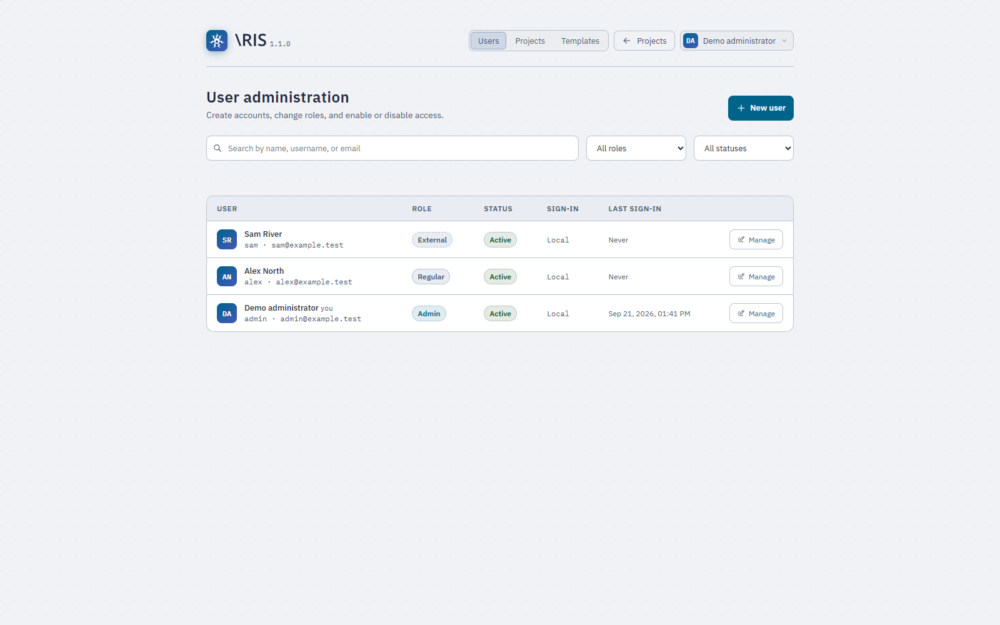

# Administer Iris

Run one Iris process for each database/storage installation. Iris keeps live
documents, project write coordination and admission queues in that process.
Use the browser console for accounts, memberships and templates, and the host
or container tools for service operation and backups.

## Accounts and server roles

Sign in as an administrator and open **Admin** on the project dashboard.
The **Users** section supports search, role/status filters, account creation,
profile changes, password resets and SSO linking.



| Server role | Scope |
| --- | --- |
| Admin | Manage accounts, templates, project memberships and project deletion. Can create projects. |
| Regular | Create/import projects and work on projects where the account is a member. |
| External | Work as an editor or viewer on shared projects. Cannot create/import or own a project. |

Project roles control source and output access. An administrator does not gain
content access by virtue of the server role; the admin projects console grants
explicit membership-management and deletion powers across the instance.

### Create, disable and reset

Create a local account with a username, email, display name and server role.
Copy its temporary password from the result and give it to the intended user.
Iris stores its Argon2id hash and requires a password change on sign-in. A local
password reset issues a new temporary password and ends existing sessions.

Disable an account to revoke access while keeping its memberships and attributed
work. You can reactivate it later. Iris refuses a change that would remove the
last active administrator, including self-demotion or self-disable. Role changes
apply to current authorization checks; disabling, password changes/resets and
local/SSO conversion revoke earlier session cookies and collaboration access.

Changing a regular/admin account to external demotes its co-owned project
memberships to editor. A sole-owned project blocks that change until you assign
another eligible owner in **Projects**.

### Delete an account

Physical deletion exists as a separate operation. The account must be **disabled
or pending**, must not be your own account, and must not be the sole owner of
any project. The deletion preview lists ownership blockers. Resolve them in
**Projects**, then enter the exact username to confirm deletion.

Deletion removes the account and its memberships. Retained history and audit
records keep their readable author labels; deletion does not anonymize those
labels or remove co-owned projects. Disabling is the reversible access-control
operation.

For SSO auto-registration, deleting a pending account does not block that
identity from registering again. Keep it pending or disabled to retain the
identity match that refuses access.

## Project administration

The **Projects** console lists projects and memberships, including an
ownerless-project filter. Use it to add an eligible owner, change roles or remove
members before deleting an account. Normal membership changes must leave an
owner; external accounts cannot take that role. Project owners have their own
sharing console for ordinary collaboration.

An administrator can delete a project here even without a content membership.
Project deletion removes source storage, database history and outputs. Iris
records the deletion and retries confirmed filesystem cleanup if needed. See
[Recovery states](#recovery-states) if the operation reports pending cleanup or
requires inspection.

## Templates

Use **Templates** to create, edit, rename, move or delete LaTeX and LilyPond
starters, and select defaults. Iris keeps the mutable catalog in `TEMPLATE_DIR`,
which defaults to `DATA_DIR/templates`. The bundled files in `public/templates`
seed that catalog once. Editing a starter affects newly created projects, not
existing ones, and needs no restart.

Templates are UTF-8 text, up to 1 MiB each, with at most 200 exposed per project
type. The [template reference](../public/templates/README.md) describes names,
localized placeholders and direct catalog files. Include an external
`TEMPLATE_DIR` in your coordinated backup if it lives outside `DATA_DIR`.

## OpenID Connect

Register an OIDC client at your identity provider. A minimal issuer-based native
configuration is:

```env
APP_BASE_URL=https://iris.example.com
OAUTH_ISSUER_URL=https://auth.example.com/application/o/iris
OAUTH_CLIENT_ID=iris
OAUTH_CLIENT_SECRET=<your provider client secret>
OAUTH_SCOPE=openid email profile
OAUTH_CLIENT_AUTH_METHOD=client_secret_basic
OAUTH_AUTO_REGISTER=false
```

Register the exact callback:

```text
https://iris.example.com/api/auth/sso/callback
```

Set `OAUTH_REDIRECT_URI` for an explicit callback override. To bypass issuer
discovery, configure `OAUTH_AUTHORIZATION_URL`, `OAUTH_TOKEN_URL` and
`OAUTH_USERINFO_URL` together. Keep `OAUTH_ISSUER_URL`: Iris uses it to identify
the provider even with explicit endpoints. `client_secret_post` is the other
supported token authentication method.

In Compose, add the needed keys to `webapp.environment`; `.env` entries alone
do not forward absent keys. See [environment forwarding](configuration.md#compose-settings-and-environment-forwarding).
Restart Iris after changing provider configuration and check the login/callback
with a test account.

### Link an existing account

Iris identifies an SSO account by **issuer plus subject**, not email alone.
For an unknown identity whose email matches an existing active unbound account,
open that account's one-time linking window in **Users**. The provider must
return `email_verified` as boolean `true`; email matching ignores case.

A successful link closes the window, removes the local password and ends prior
sessions. The account keeps its role. A known bound identity can sign in even
if its email later changes. To return a linked account to local authentication,
use **Remove SSO link**: Iris clears the binding, issues a temporary password and
requires its replacement.

### Approve new SSO users

With `OAUTH_AUTO_REGISTER=true`, an identity with no matching identity or email
can receive a new account. `OAUTH_APPROVAL_REQUIRED=true` is the default: the
account starts **pending**, and sign-in remains refused until an administrator
activates it. Filter Users by Pending and approve or disable it. Pending is an
initial state; you cannot assign an existing account back to it.

Set `OAUTH_DEFAULT_ROLE=external` for newcomers who should work only on invited
projects, or `regular` if approved users should create their own. Auto-registration
cannot assign admin. Its verified-email policy differs from existing-account
linking: the strict boolean verified-email requirement applies to linking.

## Reverse proxy and HTTPS

Set `APP_BASE_URL` to the public URL and `COOKIE_SECURE=true` for HTTPS. Configure
your proxy to carry WebSocket upgrades at `/api/collab` as well as normal HTTP.
Preserve browser `Origin`, `Referer` and `Sec-Fetch-Site` metadata.

Enable `TRUST_PROXY=true` only after the proxy replaces or strips incoming
`X-Forwarded-For`, `X-Forwarded-Host` and `X-Forwarded-Proto`. Host and protocol
must be single values, not comma-separated chains. Restrict backend access to
that proxy. Forwarded-For affects audit addresses and rate budgets even with a
pinned public URL.

With `APP_BASE_URL` set, Iris uses its origin for write and WebSocket admission.
Otherwise it derives the origin from Host and the actual connection, or trusted
forwarded host/protocol when enabled. `COOKIE_SECURE` does not set the expected
origin. A proxy configuration that changes browser origin metadata can cause
`403 REQUEST_ORIGIN_FORBIDDEN`. The developer-facing
[request contract](development.md#http-and-session-boundaries) describes precedence
and JSON media checks.

The frontend serves its IBM Plex Sans, IBM Plex Mono and CMU Serif interface
fonts locally, including on a cold browser cache. No font CDN access is needed.
The [bundled font inventory](../public/fonts/README.md) records the original
sources, pinned hashes and redistribution licenses. Editor modules, PDF.js and
PDF geometry code come from installed packages served by Iris.

## Retention

The enabled sweep runs hourly by default. For builds and text revisions, Iris
prunes an entry only if it falls outside the newest retained count **and** exceeds
the age threshold. With the defaults:

- A build must be outside the newest 20 completed builds and older than 30 days.
- A file revision must be outside that file's newest 100 revisions and older
  than 180 days.

Iris protects running builds, the latest successful build and each file's newest
revision. Owners adjust policy under **Settings → Storage**, within the instance
ceilings. Empty project values keep following your defaults. The
[configuration table](configuration.md#retention) lists floors and ceilings.

Audit retention uses age alone, defaults to 365 days, and has a 90-day floor.
The sweep also reclaims abandoned build staging and unreferenced output
directories after a six-hour default grace. It leaves recovery-blocked projects
for inspection.

With retention enabled, startup and timed sweeps mark interrupted `running`
builds as failed after `max(4 × COMPILE_TIMEOUT_MS, 5 minutes)`. Timed history
pruning begins after the first interval. `RETENTION_ENABLED=false` disables
those actions. Confirmed project-deletion cleanup remains a separate startup
action, including pruning completed deletion receipts after seven days.
Maintenance and shutdown refuse new background cleanup work.

Retention is not a storage quota: count/age protection can retain more than the
configured count, and uploaded sources/assets remain until deletion. Monitor
database, source, output and backup storage for the instance's workload.

## Audit

Iris appends authentication, administrative, sharing and destructive actions
to `audit_events`, along with checkpoints, rollbacks, compilation and retention
policy changes. Events include the action/outcome, actor label, target, client
address and bounded scalar context. Credential values do not belong in metadata.

The application has no audit-browsing console. Use a read-only query through
your database administration connection:

```sql
SELECT occurred_at, action, outcome, actor_label, target_type, target_id, ip
FROM audit_events ORDER BY occurred_at DESC LIMIT 50;
```

Deleting an account clears its foreign-key attribution but keeps recorded
labels. The retention sweep removes expired audit events. Iris logs an audit
write failure; audit storage failure does not become the reason an otherwise
completed request fails.

## Backup and restore

Back up **PostgreSQL and the entire `DATA_DIR` together**. PostgreSQL holds
accounts, memberships, file history and build records; the filesystem holds
source bytes, templates and output. Project ZIP exports cannot replace this
backup. Also preserve deployment configuration/secrets and any template catalog
outside `DATA_DIR` through your backup process.

The procedure below matches the native and actual-engine restore smokes:
enter maintenance, wait for the drain, stop Iris cleanly, then copy both layers.
Keep the target Iris process stopped until both layers have been restored.

### Maintenance and the drain

Create `MAINTENANCE_FILE` (default `DATA_DIR/.maintenance`) and poll
`GET /api/health`. Proceed only after it reports all three:

```json
{ "status": "maintenance", "maintenance": true, "pendingWrites": 0 }
```

`pendingWrites` includes accepted HTTP work, background work and realtime text
or revisions still awaiting persistence, including disconnected requests. It
does not count SQL statements. A failed realtime write remains pending; inspect
logs if the drain does not finish. Reads and presence continue while new writes
receive `503 MAINTENANCE_MODE`.

Send SIGTERM or stop the service and require **exit 0** and `Shutdown complete`.
Exit 1, a timeout or forced termination does not establish a clean backup point.
The file marker is the current maintenance interface; there is no maintenance
button in the admin console. It covers one Iris process, not external writers
or other instances.

### Native backup

Set `DATA_DIR`, `BACKUP`, `DB_NAME` and `IRIS_PID` for this instance; `BACKUP`
must be an existing, separate directory. Set PostgreSQL's `PGHOST`, `PGPORT`,
`PGUSER` and `PGPASSWORD` to the source application role. With the default marker:

```sh
touch "$DATA_DIR/.maintenance"
curl -fsS http://127.0.0.1:3000/api/health
```

Repeat the health check until the maintenance drain above completes, then:

```sh
kill -TERM "$IRIS_PID"
```

Wait for the process/service to exit cleanly before the next commands. Leave
PostgreSQL running:

```sh
PGDATABASE="$DB_NAME" pg_dump --format=custom --no-owner --no-privileges \
  --file "$BACKUP/database.dump"
tar -cf "$BACKUP/storage.tar" -C "$DATA_DIR" .
```

### Native restore

Provision a separate empty target database owned by the restricted `iris` role
and an empty target data directory. Set `PGHOST`, `PGPORT`, `PGUSER` and
`PGPASSWORD` for that target, plus `RESTORE_DB` and `RESTORE_DATA`:

```sh
pg_restore --exit-on-error --no-owner --no-privileges \
  --dbname "$RESTORE_DB" "$BACKUP/database.dump"
tar -xf "$BACKUP/storage.tar" -C "$RESTORE_DATA"
rm "$RESTORE_DATA/.maintenance"
```

The marker removal assumes the default marker included by this procedure;
handle a custom `MAINTENANCE_FILE` at its configured path. Restore ownership
and modes so the target service user can read and write its storage.

Start the target with its own DB settings, `DATA_DIR`, `TEMPLATE_DIR`, port and
session secret. Use Iris 1.1.0 with schema 2. The backed-up local passwords still
work; a new signing secret requires fresh logins. Verify project contents,
memberships, history and output downloads, then make a target-only change to
check that the target uses separate storage/database state. Successful
compilation still requires the target's toolchains.

To resume the source after backup, remove its maintenance marker and start
the source service with its original configuration.

### Container backup

Run from the source directory used for Compose. Choose one engine prefix for
the following shell functions. For Docker:

```sh
engine() { docker "$@"; }
```

For Podman:

```sh
engine() { podman "$@"; }
```

Set `PROJECT=iris`, `ENV_FILE` to the absolute source `.env` path, `BACKUP` to
an existing backup directory, and `DB_PASSWORD` to the source's restricted-role
password. Use the same engine environment, project name and environment file
as at startup:

```sh
compose() { engine compose --env-file "$ENV_FILE" -f docker-compose.yml -p "$PROJECT" "$@"; }
DATA_VOLUME="${PROJECT}_project-data"
HELPER="${PROJECT}-backup-helper"
PG_ID=$(engine ps -a -q --filter "label=com.docker.compose.project=$PROJECT" \
  --filter "label=com.docker.compose.service=postgres")
WEB_ID=$(engine ps -a -q --filter "label=com.docker.compose.project=$PROJECT" \
  --filter "label=com.docker.compose.service=webapp")
engine run --rm -i --name "$HELPER" --network none --user 0 \
  -v "$DATA_VOLUME:/restore" --entrypoint node localhost/iris:1.1.0 \
  -e "require('fs').writeFileSync('/restore/.maintenance','')"
```

Each ID must identify one container in the intended project. Check the source
HTTP health endpoint for the completed maintenance drain, then stop only Iris:

```sh
compose stop webapp
engine inspect "$WEB_ID" --format '{{.State.ExitCode}}'
engine logs "$WEB_ID"
```

Require exit 0 and the completed shutdown message before copying:

```sh
engine exec -i -e "PGPASSWORD=$DB_PASSWORD" "$PG_ID" \
  pg_dump -U iris -d iris --format=custom --no-owner --no-privileges \
  > "$BACKUP/database.dump"
engine run --rm -i --name "$HELPER" --network none --user 0 \
  -v "$DATA_VOLUME:/restore" --entrypoint tar localhost/iris:1.1.0 \
  -cf - -C /restore . > "$BACKUP/storage.tar"
```

### Container restore

Choose a new Compose project name, `TARGET_PROJECT`, and a `TARGET_ENV` file
with its own session/database/admin secrets and a distinct `IRIS_PORT`. Set
`TARGET_DB_PASSWORD` to that file's application password. Keep shell exports
from overriding the target file's secrets/port. Start only its PostgreSQL:

```sh
target_compose() { engine compose --env-file "$TARGET_ENV" -f docker-compose.yml -p "$TARGET_PROJECT" "$@"; }
target_compose up -d postgres
TARGET_PG_ID=$(engine ps -a -q --filter "label=com.docker.compose.project=$TARGET_PROJECT" \
  --filter "label=com.docker.compose.service=postgres")
engine inspect "$TARGET_PG_ID"
```

Wait for the database health status to become `healthy`. The init script creates
the empty `iris` database and restricted role. Create a new target data volume,
then restore both layers before starting the target app:

```sh
TARGET_DATA_VOLUME="${TARGET_PROJECT}_project-data"
engine volume create "$TARGET_DATA_VOLUME"
engine exec -i -e "PGPASSWORD=$TARGET_DB_PASSWORD" "$TARGET_PG_ID" \
  pg_restore -U iris -d iris --exit-on-error --no-owner --no-privileges \
  < "$BACKUP/database.dump"
engine run --rm -i --name "$HELPER" --network none --user 0 \
  -v "$TARGET_DATA_VOLUME:/restore" --entrypoint tar localhost/iris:1.1.0 \
  -xpf - -C /restore < "$BACKUP/storage.tar"
engine run --rm -i --name "$HELPER" --network none --user 0 \
  -v "$TARGET_DATA_VOLUME:/restore" --entrypoint node localhost/iris:1.1.0 \
  -e "require('fs').unlinkSync('/restore/.maintenance')"
target_compose up -d webapp
```

Check health and sign in at the target's port. Verify source text/settings,
membership restrictions and build history, then confirm a target-only change
does not alter the source. The stock container retains its missing-compiler
limit after restoration.

To resume the source, remove its marker through the same helper with
`DATA_VOLUME` mounted and run `compose up -d webapp`. Use ordinary `stop`/`up`
for service control. The smoke's `down --volumes --remove-orphans` is a destructive
test-disposal command.

## Recovery states

A failed project mutation can retain recovery bytes below
`DATA_DIR/.project-backups/<project-id>` and block access with
`503 PROJECT_RECOVERY_REQUIRED`. Stop Iris and inspect the matching database
state, manifest and source bytes before repairing the project and clearing that
backup. Preserve uncertain state for diagnosis. This is a bounded compensation
mechanism, not general crash recovery or multi-process filesystem coordination.

Project deletion records an independent receipt in `project_deletions`:

- `prepared`: an uncertain deletion requires inspection. An absent project row
  alone is not permission to remove its quarantine.
- `cleanup_ready`: database deletion is confirmed; an authorized retry or
  background cleanup can remove the remaining quarantined bytes.
- `complete`: cleanup finished. Repeated authorized deletion requests succeed
  without repeating deletion writes until the receipt expires after seven days.

A confirmed deletion with filesystem cleanup still pending returns
`cleanupPending: true`. Prepared and pending-cleanup receipts do not expire.
Startup resumes ready cleanup even with retention off; enabled sweeps also retry
it. A ready receipt with a live project row requires inspection.

## Compiler trust and instance boundaries

Iris spawns allowlisted tools without a shell, forces LaTeX `-no-shell-escape`,
controls output paths and supplies a reduced compiler environment without its
database/session secrets. These controls do not sandbox a native compiler.
LilyPond executes Guile, and both toolchains can process complex source input.
Run the qualified native model with trusted source authors and an appropriately
restricted operating-system account. Iris does not provide isolated remote
compiler workers or a multi-tenant execution sandbox.
