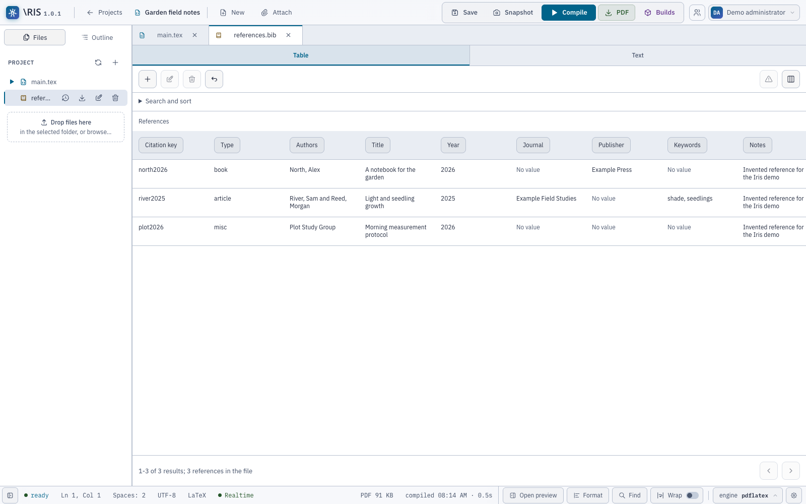

# Using Iris

You need an account on an Iris instance. Ask its administrator for a local
account or use the configured SSO button. To run your own instance, follow
[Installation](installation.md).

## Sign in and choose your workspace

Sign in with your username or email and password. Iris asks you to replace an
administrator-issued temporary password before entering the workspace. Use the
account menu for a later password change. SSO accounts use the identity provider's
credentials; a pending account needs administrator approval.

The project dashboard lists projects you belong to, including projects someone
else owns. Create a **LaTeX** or **LilyPond** project, give it a name and select
a template. Iris copies the template into `main.tex` or `main.ly`; later template
changes do not change your project. An external account can work on shared
projects but cannot create or import projects.

Choose English or Italian on the sign-in screen or in Settings. Under
**Settings → Editor → Theme**, choose **System**, **Light** or **Dark**.
The sign-in language sets this browser's default; a project's language choice
in Settings saves with that project. Theme belongs to this browser. System
follows your operating system's color preference; a theme change keeps the PDF's
document colors.

## Files and editing

Use the file tree to create folders and files, upload attachments, rename or
delete a source, and download individual files. **Refresh** reconciles the tree
with the project's files on the server. The main-source marker shows the selected
compilation entry point. Generated files appear in **Builds**, outside this tree.

Use **Attach** or **Ctrl/Cmd+O** to add an existing file. Create destination
folders in the file tree before opening the attachment dialog, then choose a
folder, check the filename and upload. Select the uploaded file in the tree to
open it. The tree's toggle is in the bottom-left corner, beside Ready.

Open files in tabs. The tab strip scrolls when the tabs exceed its width.
The outline follows LaTeX headings and environments or LilyPond music structures.
Use search and replace, formatting and editor settings to adjust how you work.
Enter completes supported LaTeX environments and LilyPond `{ … }`, `<< … >>`
and `#{ … #}` blocks, using your auto-indent preference. Comments, literal text
and uncertain syntax do not create extra structures. `.sty` and `.cls` files
start with TeX's internal command-name profile, including `@`.

The outline, collaboration regions and completion share the current syntax
summary. The outline shows an analysis status while it catches up after an edit.
Sources above 1,048,576 UTF-16 units remain editable with neutral highlighting
and an explicit unavailable-syntax message. Changing the interface language
translates generated labels without changing LilyPond's note convention.

**Format** changes leading structural indentation in one undoable operation.
It preserves literal/string bodies, blank lines, trailing spaces and line
endings. It can decline uncertain syntax; its current synchronous limit is
65,536 UTF-16 units. Finish an active input-method composition before formatting.
Included `.sty`, `.cls` and `.ily` sources use the same outline and formatting
support as their language. See [Editor language support](editor-languages.md) for the
supported syntax and work limits.

### Completion

Suggestions appear for commands and supported arguments. **Ctrl+Space** requests
the list; arrow keys select a suggestion; **Enter** or **Tab** accepts it;
**Escape** dismisses it.

LaTeX suggestions include labels in project sources, citation keys in `.bib`
files, and project-defined macros and environments. LilyPond suggestions include
variables in `.ly` and `.ily` files. Under **Settings → Editor → Custom completion
commands**, add one command name per line, with or without a leading backslash.
Each language accepts up to 200 names of at most 80 characters. Apply and save
the project to share those lists and include them in exports.

Iris continues background analysis beyond the visible part of the document.
Completion uses available symbols after a short bounded wait, so builtins remain
usable while changed files are still being analyzed. Reopen completion to include
newly analyzed symbols. Iris reuses summaries for unchanged files and uses your
live text for the open file. Suggestions match the prefix before the caret.
Accepting a suggestion replaces the full current
name or reference item, including text to the right of the caret.
It suppresses automatic commands in comments, literal text, strings and unknown
contexts. Reference and citation suggestions follow recognized argument roles.
Definitions inside a LilyPond musical literal stay local to that literal.

### Save and snapshot

**Save** persists project changes, including the file tree and settings. Project
autosave is optional and starts off; configure it under **Settings → Editor**.
Live text editing has its own server persistence: Iris writes accepted edits
after a pause and during sustained typing even with project autosave off.
Check the collaboration status for edits that the server has not confirmed.

**Snapshot** saves the project first, then records a manual history revision for
each changed, versionable text file. The database stores the text of those
revisions; the filesystem holds the current working files. Unchanged files do
not get duplicate revisions. Snapshot applies across the project's text files,
and you inspect or restore each file through its own history.

Use Save to keep the current project state and Snapshot to choose a recovery
point before a substantial edit. Compilation and idle collaborative editing also
record changed text automatically. Snapshots cover text revisions; a complete
installation backup also includes assets, settings and the other database data.
Save a new file before expecting it to have history or join a live editing session.

A conflicting whole-project save keeps your local work and reports the conflict.
Copy any work you need before choosing to discard changes or reopen the project.
A browser tab with unconfirmed edits needs attention before you close it.

## Compile a document or score

Open **Settings → Compilation**. Choose a main source or leave it on **Automatic**.
Automatic selection prefers the open source if it contains `\documentclass`
(LaTeX) or `\score` (LilyPond), then looks through project sources. A fixed main
file stays the entry point while you edit an include. After renaming or deleting
that file, choose its new path; until then Iris falls back to detection and keeps
the stale choice visible.

Press **Compile**. Iris saves the project, copies the effective source into a
build workspace and runs the selected tools. You can continue editing during
compilation, but the output represents that saved copy.

### LaTeX

Choose pdfLaTeX, XeLaTeX or LuaLaTeX from the **engine** control in the editor
footer, then select a pipeline in **Settings → Compilation**:

| Pipeline | Steps |
| --- | --- |
| Quick | One engine run. |
| BibTeX | Engine, BibTeX, two more engine runs. |
| Biber | Engine, Biber, two more engine runs. |
| Index | Engine, MakeIndex, one more engine run. |
| Custom | Up to twelve ordered steps using the supported tools and arguments. |

The server needs the selected engine and auxiliary programs. A missing `biber`,
for example, prevents a Biber pipeline from completing even if pdfLaTeX works.
For custom profiles, see the [compiler contract](development.md#compiler-contract).

### LilyPond

Choose **PDF**, **PNG**, **SVG**, **PS** or **EPS**. Iris previews PDF, PNG and
SVG; download PS and EPS from the build. Multiple scores or pages can produce
several files. LilyPond can also generate MIDI when your score requests it;
download that file from **Compilation history**.

The additional-arguments field preserves quoted values as one argument.
Iris manages the output directory and selected format, so it removes overrides
for those settings from your arguments.

### Fonts

Under **Settings → Fonts**, upload a project-local font. The chooser accepts
`.ttf`, `.otf`, `.woff` and `.woff2`; the compiler must support the font format
you use. The preview control changes the settings specimen. Select the desired
family in your LaTeX or LilyPond source to use it in the output.

Iris stores these files under `fonts/` and exposes them to the compiler's font
discovery. XeLaTeX and LuaLaTeX can use uploaded fonts through their normal font
packages; pdfLaTeX uses its own TeX font system. Renaming or deleting a font in
the file tree also updates the settings list. Uploading a font does not install
it on the host for other projects.

## Preview and build history

Read PDFs in the embedded PDF.js viewer or zoom through PNG/SVG output. Use
**Open preview / Close preview** in the footer to open or close the side panel.
The control follows its current state and works with
mapping disabled or before compilation. Iris retains the panel width and reading
position; starting a compilation reopens it. On compact screens, the footer
switches between workspaces, as does the **Editor/Preview** selector.

Open **Builds** for previous compilations, their author and duration, compiler
log, diagnostics and files. Download an individual output or a ZIP of the build.
Members with read access can inspect and download builds; owners can delete them.
Failed builds retain their diagnostics but do not publish partial output files.

Select a warning or error with a source location to open that line. Some compiler
messages have no location, so Iris displays them without a source jump. Multipass
logs contain the complete captured trace; the diagnostic list reflects the final
relevant passes and retained errors, so a resolved first-pass warning can remain
in the log without appearing as an active warning.

### Move between PDF and source

For a matching PDF build, **Ctrl-click** on Windows/Linux or **Cmd-click** on
macOS moves between the source and output:

- Click a source position to reveal its PDF area.
- Click printed text or music in the PDF to open the corresponding source.
- Use **PDF document** above the preview when a build has several PDFs. A source
  jump can select another PDF in that build.

**Settings → Compilation → Enable PDF–source mapping** starts checked. Owners
and editors can change this shared preference; viewers can navigate. Turning
it off stops navigation and map generation for subsequent builds. Turning it
back on can reuse a retained build's map. Recompile a build that lacks one.

Iris compares the current source with the compiled text before jumping. Recompile
after text changes. A rename preserves file identity and can still navigate;
missing sources, blank PDF areas or mismatches leave your current view in place.
Non-PDF formats offer preview/download without source mapping.

LaTeX navigation needs `synctex` beside the TeX tools or on the server's PATH.
Native verification covers **pdfLaTeX from TeX Live 2026** and **LilyPond 2.26.0
with Guile 3.0 and its standard PS backend**, on macOS arm64. The verified SyncTeX
engine gives source rows; LilyPond can give character positions. Other engines
and LilyPond versions may compile but do not have the same navigation qualification.
See [Source navigation](source-navigation.md#native-adapters) for details.

## Bibliographies

Open a UTF-8 `.bib` or `.ris` file to view its references as a table. Iris also
recognizes bibliography content in ordinary text files. **Text** returns to the
same source editor; **Show source** selects a reference's source range.

Search includes hidden fields and runs across the file before pagination.
Each page holds up to 100 references. Use **Columns** to hide fields and
**Show all** to restore them. Column choices last for this project/file in the
browser session; narrow panels show cards.

Use **Add**, or select a reference and choose **Edit** or **Remove**. The form
includes the entry type, citation key and **Other fields**. You can retain custom
fields and repeated RIS tags. Complex BibTeX macros and concatenations need the
Text view; Iris shows them read-only in the form.

**Apply** validates the draft and makes one undoable source edit. Save/autosave
and collaboration then handle persistence. An unchanged Apply leaves the buffer
alone. **Undo** also works from the table. Changing a citation key or removing a
reference does not update citations elsewhere in your project.

Edits outside a reference move its draft range with the source. Overlapping
edits, a reload or lost write permission block Apply and retain the draft with a
conflict message. Copy any needed draft text before changing file or project.
Iris asks before discarding a changed draft on ordinary dialog close or cancel.

An incomplete bibliography stays in Text with diagnostics; fix the syntax to
enable Table. Validation checks syntax, not scholarly accuracy or a bibliography
style's requirements. Iris preserves native source fields and expressions; it
does not fetch DOI metadata or convert BibTeX and RIS into each other.

## Sharing and live editing

Owners open the sharing console, search active accounts by username or email,
and assign a project role. Ask an administrator to create an account if the
person has none. Sharing uses accounts on the instance; there are no public
access links or invitations awaiting an unregistered person.

| Project role | Read/download | Edit/compile/restore | Manage sharing and retention | Delete project/builds |
| --- | :---: | :---: | :---: | :---: |
| Owner | Yes | Yes | Yes | Yes |
| Editor | Yes | Yes | No | No |
| Viewer | Yes | No | No | No |

A project can have several owners. Add another owner before the last owner
leaves or changes role. External accounts can be editors or viewers, but cannot
own a project. A server administrator has separate account/project-management
powers; content access still requires project membership.

Members in the same text file see accepted changes, remote cursors and selected
ranges. The file tree shows occupied files; the outline marks occupied sections.
An overlap notice identifies a shared LaTeX environment, section or LilyPond
block. It advises you to coordinate; it does not lock the source. Viewers can
receive edits without sending them.

Iris reconnects a dropped editing session and shows unconfirmed work in the
status bar. Plan to work online. If a file disappears or you lose write access,
Iris locks the buffer and retains local text for copying. If a collaborator
finishes a newer build, the preview notice lets you load it, including its log
if compilation failed. Dismiss the notice to keep reading your current output.

## History, retention and portable projects

Open a file's **History** action to inspect its revisions and restore a selected
one. Restore captures changed current text first and records the restored content
as a new revision. It also updates collaborators' open copies. History covers
losslessly readable text files up to 16 MiB; binary assets have no text revisions.
File deletion keeps its recorded history in storage, subject to retention, but
the file-history restore action requires a file that still exists in the project.
Project deletion removes the project's history and outputs.

Under **Settings → Storage**, an owner can set the number and age of retained
builds and file revisions. Leave a field empty to follow the server default.
Iris prunes an entry only if it is **both** outside the newest retained count
**and** older than the age threshold. The latest successful build and newest
revision of each file are protected from automatic pruning. The administrator
sets the permitted ranges and can disable the sweep.

Download a project ZIP from its dashboard card. An Iris export includes sources,
folders, assets, fonts, settings and exportable output files. Import creates a
separate project with new identities. Retained output can include compiler
sidecars containing compiled source and compiler paths. Project ZIPs do not
carry accounts, memberships, database revision/build history or the audit trail.
Compile an imported project to begin its build history. For complete
instance recovery, use the [administrator's backup procedure](administration.md#backup-and-restore).

## Common interruptions

| Message or symptom | Next step |
| --- | --- |
| Compiler missing / failed to start | Ask the operator to check the executable in Iris's runtime. The stock container has no compilers. |
| PDF navigation unavailable or source changed | Check mapping is enabled, recompile, and check the qualified toolchain above. |
| Maintenance | Keep the tab open. Iris pauses writes while the operator drains work; reads and presence continue. |
| Too many requests / server busy | Wait and retry. The server bounds login and compile work. |
| Project save conflict | Preserve your local work before reopening or discarding. |
| Project recovery required | Ask the operator to inspect the database and retained project backup. |
